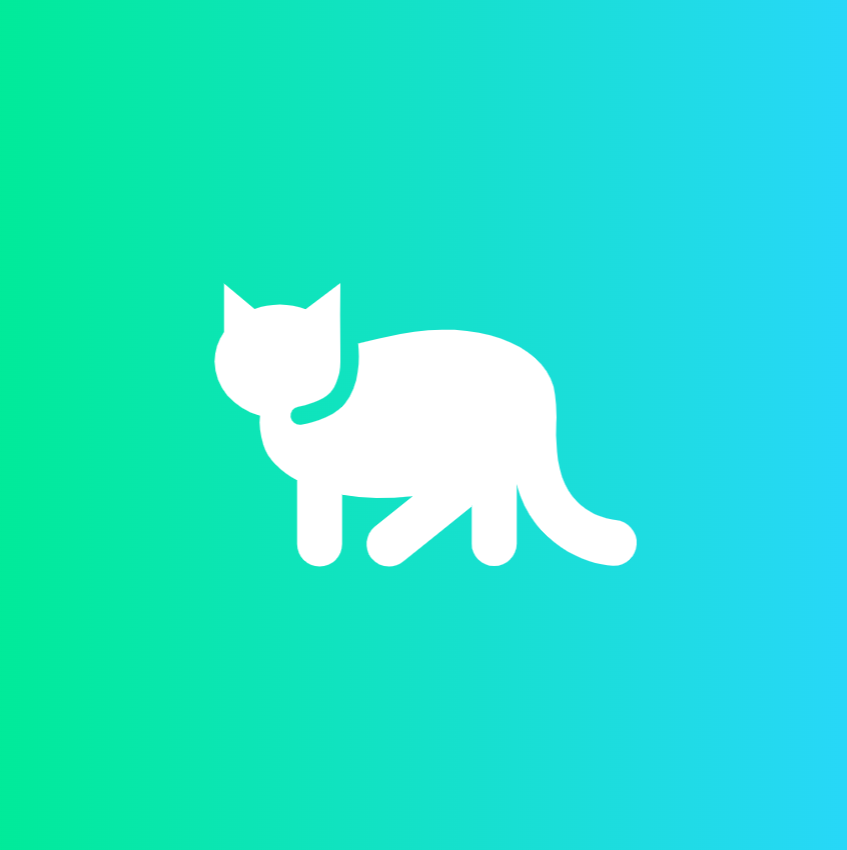

<h1 align="center"> Nyanshop </h1> <br>
<p align="center">
  <a href="">
    
  </a>
</p>

<p align="center">
  E-commerce Platform for Cat Lovers 🐾🛒
</p>

# Mobile App w/Kotlin: Nyanshop 😺🛒

This repository contains the Mobile Programming with Kotlin Project Title "Nyanshop" 🐱🛍️

## Table of Contents

1. [Project Overview](#project-overview)
2. [Mockup Screenshot](#mockup-screenshot)
3. [Web Demo](#web-demo)
4. [Prerequisite](#prerequisite)
5. [How to Run Project Locally](#how-to-run-project-locally)

## Project Overview

### Project Name

Nyanshop

### Explanation

Nyanshop is an e-commerce platform designed to offer a wide variety of products for pet lovers! Whether you're looking for pet food, toys, or accessories, Nyanshop has it all. Enjoy shopping for your furry friends with ease and at affordable prices. Shop with Nyanshop now and give your pets the best! 🐱❤️🛒

## Mockup Screenshot

- Auth Page

  - Login Page
    <p align="center">
      
    </p>

  - Register Page
    <p align="center">
      
    </p>

- Home Page

  - No Available Cat Yet Page
    <p align="center">
      
    </p>

  - Owned Cat Page
    <p align="center">
      
    </p>

- Shop Page

  - Main Shop Page
    <p align="center">
      
    </p>

  - Store Map Page
    <p align="center">
      
    </p>

- Profile Page

  - Main Profile Page
    <p align="center">
      
    </p>

  - Edit Profile Dialog
    <p align="center">
      
    </p>

  - Chat with SMS Page
    <p align="center">
      
    </p>

## Web Demo

- Buy Pet from Shop

  <p align="center">
    
  </p>

- Edit Profile

  <p align="center">
    
  </p>

### Technology and Infrastructure

This project is built using the following tools and technologies:

- **IDE**: [Android Studio](https://developer.android.com/studio) (for building the mobile application)
- **Programming Language**: [Kotlin](https://kotlinlang.org/) (for developing the mobile app)
- **Database**: [SQLite](https://www.sqlite.org/) (for local database management on the device)
- **Google Maps API**: [Google Maps SDK for Android](https://developers.google.com/maps/documentation/android-sdk) (for map-based features)
- **Deployment**: Google Play Store for mobile app distribution

## Prerequisite

Before running this project, ensure the following tools are installed on your system:

1. **Android Studio**:

   - Install [Android Studio](https://developer.android.com/studio) to develop the mobile application.
   - Ensure the latest version of Android SDK is installed for building the app.

2. **Kotlin**:

   - The project uses Kotlin, which is supported natively in Android Studio.

3. **Google Play Developer Account** (for app deployment):

   - If you plan to deploy the app to the Google Play Store, you will need a [Google Play Developer account](https://play.google.com/console/about/).

4. **SQLite** (for local database):

   - No installation required for SQLite as it is included in the Android framework.

5. **Google Maps API Key**:
   - Obtain a [Google Maps API key](https://developers.google.com/maps/gmp-get-started) from Google Cloud Console for map functionalities.

## How to Run Project Locally

Follow these steps to set up and run the project locally on your Android device or emulator:

---

### 1. Clone the Repository

- Clone the repository to your local machine:

  ```bash
  git clone https://github.com/Kimchiigu/nyanshop.git
  ```

### 2. Open the Project in Android Studio

- Open Android Studio and select **Open an existing project**.
- Navigate to the directory where you cloned the project and open the `nyanshop` project.

### 3. Set Up Dependencies

- Android Studio will automatically detect the dependencies from the `build.gradle` files and prompt you to sync the project. Click **Sync Now** to install required libraries.

### 4. Configure Google Maps API

- **Google Maps API**: Add your Google Maps API key in the `local.properties`:

  ```properties
  MAPS_API_KEY="YOUR_API_KEY"
  ```

### 5. Run the Project

- Connect your Android device or start an emulator.
- Click the **Run** button in Android Studio or use the following command:

  ```bash
  ./gradlew installDebug
  ```

### 6. Test the App

- Once the app is installed, open it on your device or emulator.
- Test features like product browsing, cart, and SMS notifications.

---

Lovely made by me! CG24-2
